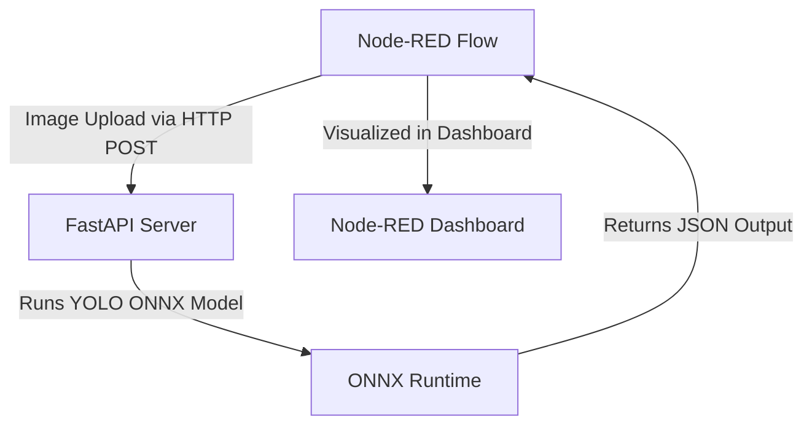

# YOLO ONNX Object Detection with FastAPI + Node-RED

---

## Overview

This project demonstrates how to **bridge FastAPI** (for high-speed inference) and **Node-RED** (for automation and visualization) to perform **real-time object detection** using a **YOLO ONNX model**.

Instead of running heavy ML inference inside Node-RED, which can be unstable or slow, we **offload inference to FastAPI**, which loads the YOLO model once and responds to requests efficiently.
Node-RED then orchestrates the flow, handles inputs, and visualizes results.

> 📘 **Detailed step-by-step guide available here:**
> [**Bridging Node-RED and FastAPI for YOLO ONNX Object Detection**](https://medium.com/@abbirami.vnr/bridging-node-red-and-fastapi-for-yolo-onnx-object-detection-259151d39914)

---

## 🧩 Project Structure

```bash
C:\Users\User\.node-red\scripts\
│
├── predict_api.py         # FastAPI inference server
├── yolo11n.onnx           # YOLO ONNX model file
├── Cat.jpg                # Sample image
├── node-red-flow.json     # Node-RED flow definition
├── README.md              # Documentation
└── venv/                  # Python virtual environment (optional)
````

-----

## ⚙️ Requirements

| Component | Version | Description |
| :--- | :--- | :--- |
| **Python** | $\ge 3.9$ | For running FastAPI and ONNX Runtime |
| **Node-RED** | $\ge 3.0$ | For flow-based orchestration |
| **FastAPI** | latest | REST API framework |
| **Uvicorn** | latest | ASGI server for FastAPI |
| **ONNX Runtime** | latest | Runs YOLO model on CPU/GPU |
| **OpenCV, Pillow, NumPy** | latest | Image preprocessing & handling |

### Install Dependencies:

```bash
pip install fastapi uvicorn numpy opencv-python onnxruntime pillow
```

-----

## Setup & Run

### 1️⃣ Create and Activate Virtual Environment

```bash
python -m venv venv
venv\Scripts\activate     # Windows
# OR
source venv/bin/activate  # macOS/Linux
```

### 2️⃣ Install Dependencies

```bash
pip install fastapi uvicorn numpy opencv-python onnxruntime pillow
```

### 3️⃣ Place Your Model

Place your YOLO model file (e.g., `yolo11n.onnx`) inside:

```
C:\Users\User\.node-red\scripts\
```

### 4️⃣ Run FastAPI Server

```bash
uvicorn predict_api:app --reload --host 127.0.0.1 --port 8000
```

### 5️⃣ Test API Endpoint

Visit:

👉 `http://127.0.0.1:8000/docs`

Upload an image under `/predict` → **Execute**

You’ll receive a JSON response with detected object details.

### 📸 Sample Response

```json
{
  "success": true,
  "best_detection": {
    "class": "cat",
    "confidence": 0.934,
    "box": [102.53, 69.40, 443.82, 603.23]
  },
  "inference_time_ms": 88.34
}
```

-----

## 🔗 Node-RED Integration

### 💡 Import the Flow

1.  Open Node-RED Editor → `http://127.0.0.1:1880`
2.  Click **Menu** → **Import** → **Clipboard**
3.  Paste the JSON from `node-red-flow.json`
4.  Click **Deploy**

### 🔧 Flow Components

| Node | Function |
| :--- | :--- |
| **Inject** | Triggers workflow manually |
| **File In** | Reads local image |
| **Function** | Prepares `multipart/form-data` payload |
| **HTTP Request** | Sends `POST` to FastAPI `/predict` |
| **Debug** | Prints detection result |
| **Image Viewer** | Displays input image |

### HTTP Node Configuration

| Setting | Value |
| :--- | :--- |
| **Method** | `POST` |
| **URL** | `http://127.0.0.1:8000/predict` |
| **Headers** | `Content-Type: multipart/form-data` |

-----

## 🧱 Architecture



### Component Breakdown

| Component | Role |
| :--- | :--- |
| **Node-RED** | Controls workflow, manages automation, visualizes results |
| **FastAPI** | Loads YOLO ONNX model, performs inference, returns JSON |
| **ONNX Runtime** | Executes the model efficiently on CPU/GPU |
| **Data Flow** | Image → FastAPI → JSON → Node-RED dashboard |

### ⚖️ Why This Architecture Works

  * **Performance:** Model is loaded once in FastAPI, reused for all inferences.
  * **Stability:** Node-RED only handles lightweight HTTP requests.
  * **Scalability:** Can easily deploy FastAPI as a microservice.
  * **Portability:** Works on Windows, Linux, or Raspberry Pi.
  * **Clarity:** Clear separation between inference logic and automation logic.

-----

## 🔮 Next Steps

  * ✅ Add full YOLO postprocessing (Non-Max Suppression, multiple detections)
  * ✅ Integrate Node-RED Dashboard for real-time visualization
  * ✅ Package FastAPI as Docker container
  * ✅ Try GPU acceleration using `CUDAExecutionProvider`

-----

## 📚 References

  * 🧾 **Medium Tutorial:** [Bridging Node-RED and FastAPI for YOLO ONNX Object Detection](https://medium.com/@abbirami.vnr/bridging-node-red-and-fastapi-for-yolo-onnx-object-detection-259151d39914)
  * ⚙️ [FastAPI Documentation](https://fastapi.tiangolo.com/)
  * 🔴 [Node-RED Documentation](https://nodered.org/docs/)
  * 💡 [ONNX Runtime](https://onnxruntime.ai/)

-----

## Author

👩‍💻 **Abbirami Jegan**

🔗 [LinkedIn](https://www.linkedin.com/in/abbirami-jegan)

```
```
